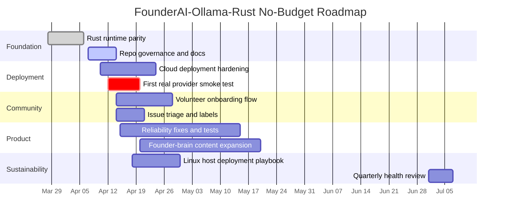

# Roadmap

This roadmap follows the current no-budget strategy: keep the product practical,
portable, and recruitable before adding new complexity.

## Timeline

## Near-Term Milestones

- `v0.1`: working Rust runtime with provider switching and safe artifacts
- `v0.2`: deployment hardening, smoke-test proof, and onboarding docs
- `v0.3`: contributor-friendly issue flow, more tests, and stable cloud operation

## Maintainer Notes

- Prefer issues tagged `good first issue` and `documentation` for new contributors.
- Keep roadmap changes tied to the project charter so scope does not drift.
