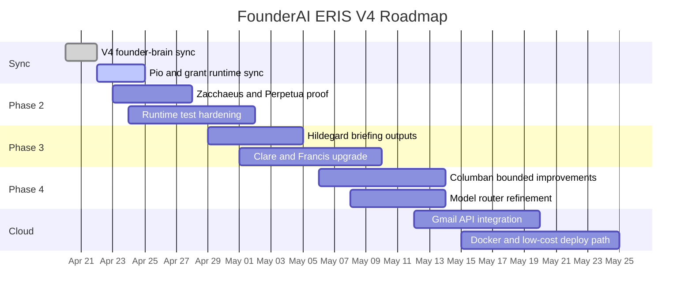

# Roadmap

This roadmap reflects the April 2026 V4 documents: keep the Rust runtime stable, sync it to the Techni-Drones and grant context, then extend toward Gmail and cloud portability without changing the FounderAI shape.

## Timeline

## Near-Term Milestones

- `v0.2`: V4 strategy sync, Pio deadline routing, and Bartholomew grant artifacts
- `v0.3`: Phase 2 proof for Zacchaeus and Perpetua
- `v0.4`: Hildegard, Clare, and Francis strengthened around daily briefings and weekly review
- `v0.5`: Gmail-connected local-first cloud bridge

## Guardrails

- No phase is allowed to weaken approvals.
- No cloud work should delete file-auditable behavior before an inspectable replacement exists.
- New agents should extend the six-lane structure, not replace it.
